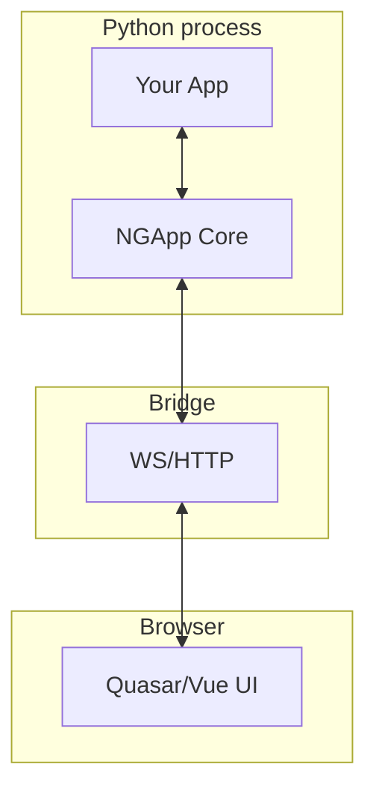

# NGApp

A Python framework for building interactive scientific and engineering applications as web or desktop apps — **without writing JavaScript**. NGApp wraps a modern Quasar/Vue frontend with a clean, Python-first API and automatic state synchronization.

<p align="center">
  <em>Turn scripts and notebooks into polished apps with reactive UIs, events, and deployment baked in.</em>
</p>

---

## ✨ Highlights

* **Python-only UI**: Compose rich interfaces from Python (Quasar components under the hood).
* **Reactive state & events**: Bind inputs, handle callbacks, and keep frontend & backend in sync.
* **Batteries included**: Helper components (forms, tables, file I/O, warnings), plotting hooks, and deploy-to-GitHub workflow.
* **Dev mode**: Hot reload (`--dev`) for instant feedback while editing.

---

## 📦 Installation

```bash
pip install ngapp[dev]
```

> The `[dev]` extra includes tools useful during development. End users of your apps typically only need `ngapp`.

---

## ⏱️ 90‑second minimal app

1. **Create a new app** (answer the prompts)

   ```bash
   python -m ngapp.create_app
   ```

   The wizard asks for your **module name**, **app name**, and **app class** (valid Python identifiers).


2. **Run in development mode**

   ```bash
   python -m <module_name> --dev
   ```

   Dev mode enables hot reload and opens the app in your browser (or prints a link in the console).

3. **Project layout**

   ```text
   <module_name>/
   ├─ src/
   │  └─ <module_name>/
   │     ├─ __init__.py
   │     ├─ app.py            # main app code
   │     ├─ appconfig.py
   │     └─ __main__.py
   ├─ .github/
   │  └─ workflows/deploy.yml # deploys web version to GitHub Pages
   ├─ README.md
   └─ pyproject.toml
   ```

4. **Make your first change**
   Open `src/<module_name>/app.py` and tweak labels or the `increment_counter` function. Save the file and watch the UI update immediately in the browser while logs print to the console.

---

## 🧭 Architecture (at a glance)

NGApp keeps your Python logic in sync with a Quasar/Vue UI in the browser. Only minimal diffs are sent across a lightweight bridge.



**How it fits together**

* **Components** are declared in Python (wrapping Quasar). Their props/events map to the frontend.
* **Bridge** sends UI/state changes and events (e.g., `on_click`) efficiently.
* **Dev mode** hot‑reloads Python and refreshes the UI without losing state where possible.

---

## 📚 Documentation & examples

👉 **Documentation:** [https://cerbsim.github.io/ngapp](https://cerbsim.github.io/ngapp)

* **Getting Started**: installation, scaffolding, and first run
* **Components**: Quasar wrappers (e.g. `QBtn`, `QInput`, `QTable`) and helper widgets
* **Tutorials**: Parametric Sine Wave, NACA Airfoil, Beam Solver, Deploy to GitHub Pages

---

## 📄 License

LGPL‑2.1
